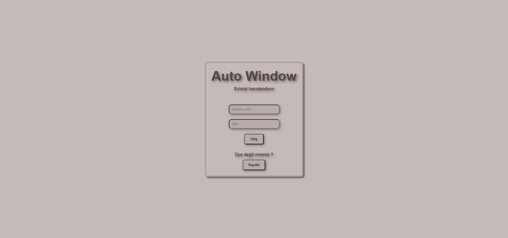
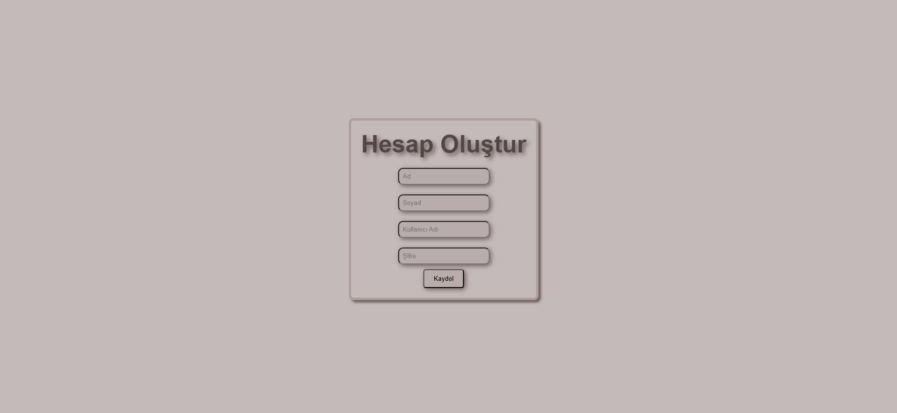
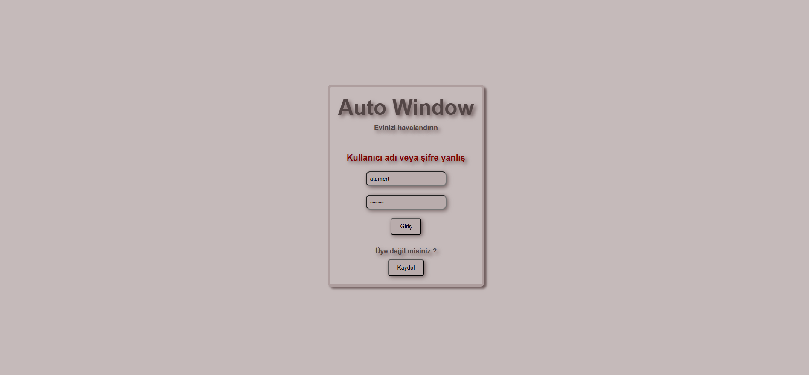

# 🏠 AutoWindow: Smart Home Window Automation System


## 📖 Overview
**AutoWindow** is a full-stack smart home application designed to automate and remotely control residential windows. Users can register their home addresses and manage window states manually (Open/Close) or set them to "Automatic" mode, allowing the system to make intelligent decisions based on environmental factors.

This project demonstrates a robust architecture integrating a **Java Spring Boot backend** for data management, and a user-friendly **React.js frontend**.

## 🏗️ Architecture & Tech Stack

The system is built on a microservices-based architecture:

* **💻 Frontend (React.js):** Provides an intuitive interface for users to log in, manage their homes, and control window modes.
* **⚙️ Backend (Java & Spring Boot):** Handles user authentication, stores address data, manages window states in a PostgreSQL database, and serves RESTful APIs.
* **🧠 Automation Engine :** (Processes external data or sensor feeds to determine the optimal state for windows in "Automatic" mode - For now, this part skipped just a dashboard part is created.

## 🚀 Features
* **User Authentication:** Secure Sign-Up and Login processes with error handling.
* **Home Management:** Users can add their home addresses to the system.
* **Smart Controls:** Provide manual commands (**Open**, **Close**) or set the system to **Automatic** mode for hands-free operation.
* **Intuitive Dashboard:** A clean user interface to view and manage listed homes.

## 📸 Screenshots

| User Login | Account Registration |
|:---:|:---:|
|  |  |
| *Secure user authentication entry point.* | *New user registration form.* |

| Main Dashboard & Controls | Error Handling |
|:---:|:---:|
|  |  |
| *Home address management and window control panel.* | *Clear feedback for incorrect login attempts.* |

## 🛠️ Installation & Setup

### Prerequisites
* Java JDK 17+
* Node.js & npm
* PostgreSQL Database

### 1. Clone the Repository
```bash
git clone https://github.com/atamertcan/autowindow.git
cd autowindow```

### 2. Backend Setup (Spring Boot)
Navigate to the backend folder.

**Important:** You must configure the database connection before running.
1. Create a PostgreSQL database named 'autowindow'.
2. Open 'src/main/resources/application.properties'.
3. Update 'spring.datasource.username' and 'spring.datasource.password' with your local PostgreSQL credentials.

Then run the application:
```bash
cd autowindow_server
./mvnw spring-boot:run```
